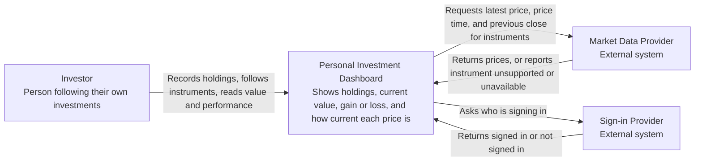

# Lab 1: Define the Initial Product: Personal Investment Dashboard

## 1. Product research

**Research question:** How do existing products help a User follow market information, and which parts belong in this Dashboard's first version?

**Products examined (public pages only, no accounts):**

- Market data product: [Apple Stocks](https://apps.apple.com/us/app/stocks/id1069512882), using its App Store description and the Apple Support pages [Check stocks on iPhone](https://support.apple.com/guide/iphone/check-stocks-iph1ac0b1bc/ios) and [Manage watchlists in Stocks on iPhone](https://support.apple.com/guide/iphone/manage-multiple-watchlists-iph4fff7afb5/ios).
- Trading product: [Interactive Brokers ](https://www.interactivebrokers.com/en/trading/client-portal.php) and its [navigation overview](https://www.interactivebrokers.com/campus/trading-lessons/navigating-and-trading-using-ibkrs-client-portal/).

| Product | Likely User and goal | Reusable pattern |
| ------- | -------------------- | ---------------- |
| Apple Stocks | A person who wants a quick look at prices, daily change and news for stocks, funds, indexes and currencies they follow, without trading. Apple describes following daily performance through watchlists, quotes and charts. | (a) **Follow an instrument** by searching for it by ticker, company, fund or index and adding it to a list. (b) Show **price, price change and percentage change at a glance** for each followed instrument. (c) **Drill down** from one instrument to a chart and details for a chosen time range. |
| Interactive Brokers | A person who holds a brokerage account and wants to monitor and manage it. The home page shows rate of return, portfolio positions, recent transactions, available cash and news. The same portal also places orders, funds the account and produces statements and tax reports. | (a) A **positions overview** with a portfolio value and performance summary over a chosen time period. (b) **Drill-down** from one position to its detail. (c) **Transactions or history** kept so returns can be explained. |

**What the research changed or confirmed about scope:**

| Evidence | Scope decision | Effect |
| -------- | -------------- | ------ |
| Apple's pages describe following instruments and viewing quotes, charts and news. They do not describe recording how many units you own or what you paid, so the app shows market movement but not what *your* holdings are worth (an observation from the pages read, not proof that the feature is absent). | Keep two ideas: *holdings* the Investor owns and *followed instruments* the Investor only watches. Holdings with value and gain or loss are what this Dashboard adds. | **Changed.** I started with holdings only. Apple Stocks added the followed-instruments goal, and also shows where a pure watchlist stops. |
| Apple offers multiple named watchlists, charts over several time ranges, news, and earnings reminders. | The first version has one followed list, no charts or news, and no reminders. | **Changed.** Cut features the Investor does not need to answer the promise. |
| One third-party guide says Apple's app supports major stocks and some indices, while cryptocurrency and mutual fund support may vary ([Asurion](https://www.asurion.com/connect/tech-tips/how-to-use-stocks-app-ios-18/)). This is treated as an assumption. | Some instruments may not be supported, so an "unsupported" result is a normal outcome. | **Confirmed** the need for an unsupported result. |
| Interactive Brokers combines monitoring with trading, funding and tax reports, and offers consolidation of outside accounts as a separate free tool (PortfolioAnalyst). | The Dashboard only helps the Investor *follow*. It does not trade, fund, or produce tax reports, and it does not import accounts from brokerages or banks. The Investor enters holdings by hand. | **Confirmed** the non-goals for trading, tax reports, and automatic import. |
| Interactive Brokers shows value and rate of return over a time period, with drill-down per position. | First version shows value, gain or loss since purchase, and change since the previous close. Long-term performance charts are deferred. | **Confirmed** a small performance goal and deferred the rest. |

Unverified claims from third-party pages are recorded as assumptions (see section 3), not facts.

---

## 2. Stakeholders and actors

Method: [UK Government stakeholder-mapping guide](https://analysisfunction.civilservice.gov.uk/policy-store/stakeholder-mapping/).

| Stakeholder | Motivation | Influence | Reason |
| ----------- | ---------- | --------- | ------ |
| Investor (the person following their own investments) | High | High | The Dashboard exists for them, and if they do not trust the numbers they will stop using it. |
| Product owner (the client who asked for the Dashboard) | High | High | Decides what is in the first version and accepts the result. |
| Market Data Provider | Low | High | Does not care about this product in particular, but its data terms and availability decide what results can be shown at all. |
| Financial and data-protection regulators | Low | High | Do not use the Dashboard, but rules on presenting financial information and on personal financial data can limit what it may show or keep. |
| Investor's financial advisor | High | Low | Would benefit from a clear view of a client's holdings but cannot change product decisions in the first version. |
| Brokerage or bank holding the Investor's real accounts | Low | Low | Owns the source of truth for real holdings, but is not connected in the first version and is not affected by it. |
| Sign-in Provider | Low | Low | Confirms who the Investor is. Failure affects access, but it has no stake in the product's decisions. |

| Motivation | Low influence | High influence |
| ---------- | ------------- | -------------- |
| **High** | **Consult with:** Investor's financial advisor | **Manage closely:** Investor, Product owner |
| **Low** | **Keep informed:** Brokerage or bank, Sign-in Provider | **Keep satisfied:** Market Data Provider, Regulators |

**Classification:**

| Candidate | Classification | Reason |
| --------- | -------------- | ------ |
| Investor | **Direct human actor** | Records holdings and reads results. |
| Market Data Provider | **External system** | The Dashboard directly asks it for prices and instrument details. |
| Sign-in Provider | **External system** | The Dashboard directly asks it to confirm who is signing in. |
| Product owner | Other stakeholder | Decides scope but is not in the Investor's journey. |
| Regulators | Other stakeholder | Impose limits but do not interact with the Dashboard. |
| Investor's financial advisor | Other stakeholder | Sharing with an advisor is a non-goal, so there is no direct interaction. |
| Brokerage or bank | Other stakeholder | Not connected in the first version. |

Only the Investor, Market Data Provider and Sign-in Provider appear in the System Context view.

---

## 3. Product promise and scope

**Product promise**

> The **Personal Investment Dashboard** helps an **individual Investor** solve the problem of **investment information being scattered and hard to trust**, so that **they can see what they own, what it is worth now, and how it has changed, and can tell how current each figure is**.

**Goals** (each is a result the Investor can see)

1. The Investor can record the investments they own (instrument, quantity, purchase price) and see them together in one list.
2. The Investor can see the current value of each holding and of the whole portfolio, together with the time of the price used.
3. The Investor can see the gain or loss since purchase and the change since the previous close, for each holding and in total.
4. The Investor can follow instruments they do not own and see their latest price.
5. The Investor sees only their own investments, and any price that is missing, not current, or unsupported is clearly labelled instead of shown as a normal number.

**Non-goals** (not now, not never)

1. **No trading.** The first version does not place, route, or confirm orders, and does not hold or move money.
2. **No automatic import.** The first version does not read holdings or transactions from brokerages or banks. The Investor enters them.
3. **No advice or extras.** The first version does not give recommendations, price alerts, tax reports, or sharing with other people such as an advisor.

**Constraints and assumptions**

| Type | Statement |
| ---- | --------- |
| Constraint | One Investor sees only their own data. |
| Constraint | The first version supports one portfolio currency per Investor. Instruments quoted in another currency are unsupported. |
| Constraint | The first version is read-only for markets: it shows information but does not act on it. |
| Assumption | The Market Data Provider can supply a recent price and its time for the instruments the Investor enters. |
| Assumption | Some instrument types (for example cryptocurrency or some funds) may not be supported by the Market Data Provider (from a third-party guide about Apple Stocks; needs verification). |
| Assumption | The Sign-in Provider returns a usable "signed in / not signed in" result. |
| Assumption | How old a price may be before it counts as "not current" will be decided in Lecture 3 as a measurable quality requirement. |

**Consistency check:** every goal supports the promise (what they own, what it is worth, how it changed, how current); the non-goals remove trading, import and advice, which no goal or story needs.

---

## 4. Functional requirements

### DASH-1: Record a holding

- **Actor goal:** The Investor needs to tell the Dashboard what they own.
- **User story:** As an Investor, I want to record an investment I own with its quantity and purchase price, so that it is included in my portfolio.

Definitions of done:

- After saving a valid holding, it appears in my list with its instrument, quantity, and purchase price.
- If the instrument is not recognized or is quoted in an unsupported currency, the Dashboard shows that it is unsupported and does not add it to my portfolio value.
- If the quantity or purchase price is missing or not a positive number, the holding is rejected with a reason and is not added.
- The holding is visible only to me.

### DASH-2: See current value with price time

- **Actor goal:** The Investor needs to learn what their investments are worth now and how much to trust that figure.
- **User story:** As an Investor, I want to see the current value of each holding and of my whole portfolio with the time of each price, so that I know what I own is worth and how current the figure is.

Definitions of done:

- Each holding shows its latest price, the time of that price, and its value (quantity times price).
- The portfolio total includes only holdings that have a current price, and states how many holdings are left out and why.
- If a price is missing, the holding shows "price unavailable". It is never shown as zero or as an earlier value presented as current.
- If a price is older than the accepted freshness limit, the holding shows "not current" with the time of that price.

### DASH-3: See gain or loss and daily change

- **Actor goal:** The Investor needs to learn how their investments have performed.
- **User story:** As an Investor, I want to see gain or loss since purchase and change since the previous close, so that I understand how my investments have moved.

Definitions of done:

- Each holding and the portfolio show gain or loss (current value minus purchase cost) as an amount and a percentage.
- Each holding and the portfolio show change since the previous close.
- If the current price or previous close is missing or not current, the affected figure shows "unavailable" or "not current", and the portfolio total states which holdings it leaves out.
- Holdings in an unsupported currency are excluded from totals and labelled as unsupported.

### DASH-4: Follow an instrument I do not own

- **Actor goal:** The Investor needs to keep an eye on instruments they are considering or interested in.
- **User story:** As an Investor, I want to follow an instrument without owning it, so that I can watch its latest price.

Definitions of done:

- After I follow a recognized instrument, it appears in my followed list with its latest price and the time of that price.
- Following an instrument does not change my portfolio value or gain or loss.
- If the instrument is not recognized or not supported, the Dashboard says so and does not add it.
- If its price is missing or not current, the followed list shows "price unavailable" or "not current".

### DASH-5: Correct or remove a holding

- **Actor goal:** The Investor needs the Dashboard to match what they really own after a purchase, sale, or mistake.
- **User story:** As an Investor, I want to change or remove a holding I recorded, so that my portfolio reflects what I own.

Definitions of done:

- After I change a holding's quantity or purchase price, the list, value, and gain or loss reflect the new numbers.
- After I remove a holding, it no longer appears and is no longer part of any total.
- I can change or remove only my own holdings. An attempt on someone else's holding is refused as unauthorized and changes nothing.

### DASH-6: See only my own investments

- **Actor goal:** The Investor needs their financial information to stay private.
- **User story:** As an Investor, I want to sign in and see only my own investments, so that my financial information is not exposed to anyone else.

Definitions of done:

- After a successful sign-in, I see my holdings and followed instruments and no one else's.
- A person who is not signed in sees no holdings or followed instruments.
- If the Sign-in Provider's result is missing, the Dashboard says sign-in is unavailable and shows no investment data.

### Traceability

| Story | Supports goal(s) | Alternative results covered |
| ----- | ---------------- | --------------------------- |
| DASH-1 | 1, 5 | unsupported, rejected input |
| DASH-2 | 2, 5 | missing, not current |
| DASH-3 | 3, 5 | missing, not current, unsupported |
| DASH-4 | 4, 5 | unsupported, missing, not current |
| DASH-5 | 1, 5 | unauthorized |
| DASH-6 | 5 | unauthorized, missing sign-in result |

No story implements a non-goal: none places orders, imports from a brokerage, or gives advice, alerts, or sharing.

---

## 5. C4 System Context view

**System of interest:** Personal Investment Dashboard. **Direct human actor:** Investor. **Directly connected external systems:** Market Data Provider, Sign-in Provider.

**External system checks**

| External system | Dashboard responsibility that needs it | Result it supplies | What the Investor sees when the result is missing, not current, or unsupported |
| --------------- | -------------------------------------- | ------------------ | ---------------------------------------------------------------------------------- |
| Market Data Provider | Show current value, gain or loss, and change since previous close (DASH-2, 3, 4); recognize instruments when recording (DASH-1) | Latest price with its time, previous close, whether the instrument is recognized and its currency | **Missing:** "price unavailable", never zero. **Not current:** "not current" with the price time. **Unsupported:** "unsupported", excluded from totals with a reason. |
| Sign-in Provider | Show only the signed-in Investor's data (DASH-5, 6) | Whether the person is signed in, and who they are | **Missing:** "sign-in unavailable" and no investment data shown. **Not signed in:** no investment data shown. |

**Ownership split:** each external system owns its source result, meaning the price or the sign-in decision. The Dashboard owns how that result becomes clear and safe for the Investor: it requests it, interprets it, refuses to turn an unknown result into a false number, and labels missing, not-current, and unsupported results.

**Boundary summary**

| Inside the Dashboard boundary | Outside the Dashboard boundary |
| ----------------------------- | ------------------------------ |
| Keep the Investor's recorded holdings and followed instruments | Investor supplies what they own, quantities, and purchase prices |
| Compute value, gain or loss, and change from recorded holdings and received prices | Market Data Provider decides what the current price and previous close are |
| Label missing, not-current, and unsupported results | Sign-in Provider decides who is signed in |
| Show each Investor only their own data | Brokerages and banks hold the real accounts (not connected in first version) |

---

## Checklist

- [x] I researched at least two existing products (Apple Stocks, Interactive Brokers).
- [x] I cited evidence for each selected product pattern.
- [x] My research changed at least one scope decision (added followed instruments) and confirmed others.
- [x] I mapped stakeholder motivation and influence.
- [x] I separated stakeholders, direct human actors, and external systems.
- [x] My product promise is one clear sentence.
- [x] My goals and non-goals agree with my product promise.
- [x] I wrote at least five user stories (six).
- [x] Every story has two to four definitions of done.
- [x] At least two stories include an important alternative result.
- [x] My external dependencies include a User-visible missing, stale, or unsupported result.
- [x] I created a C4 System Context view of the Dashboard.
